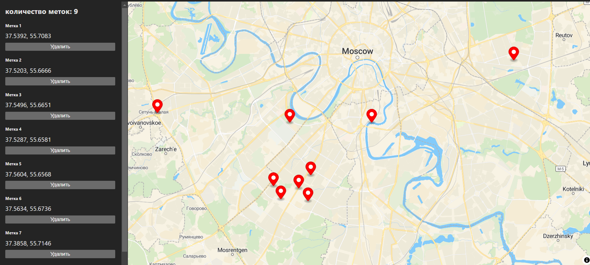

# react-map-maplibre

[Ссылка на демонстрацию](https://ri-yarm.github.io/react-map-maplibre/)

Проект написан с исспользованием vite, redux toolkit, typescript, maplibre

### **Установка**

* Клонируйте этот репозиторий на свой компьютер
* Перейдите в папку проекта и запустите `npm install`
* Пропишите в консоли `npm run build`
* Пропишите в консоли `npm run preview`
* Перейдите на локальную ссылку для просмотра проекта(обычно она открывается сама).

Если есть проблемы обратитесь к соответствующему специалисту
***
